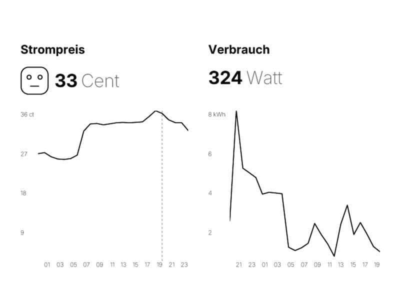

# Tibber Dashboard

A minimalist e-ink friendly dashboard that displays Tibber power consumption and price data.

## Features

- Real-time power consumption display
- Current and upcoming electricity prices
- Price level indicator (very cheap to very expensive)
- Minimalist black & white design optimized for e-ink displays
- Uses [Satori](https://github.com/vercel/satori) to generate PNGs server-side



## Setup

1. Clone the repository:

   ```bash
   git clone https://github.com/fgnass/tibber-dashboard.git
   cd tibber-dashboard
   ```

2. Install dependencies:

   ```bash
   npm install
   ```

3. Get your Tibber API token from [developer.tibber.com](https://developer.tibber.com)

4. Start the development server:

   ```bash
   npm run dev
   ```

5. Open http://localhost:3000/YOUR-TOKEN/dashboard.png in your browser, replacing `YOUR-TOKEN` with your actual Tibber API token.

## License

MIT
